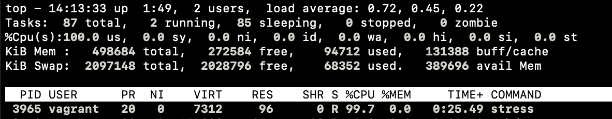
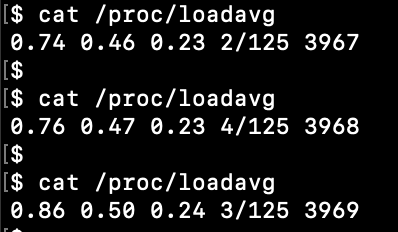
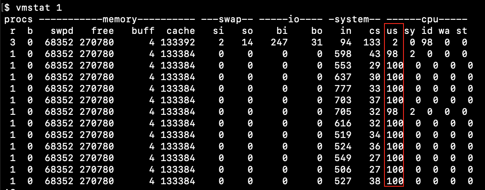
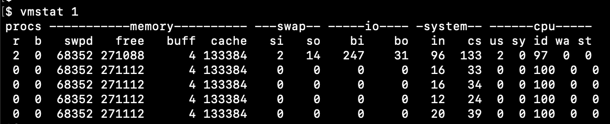
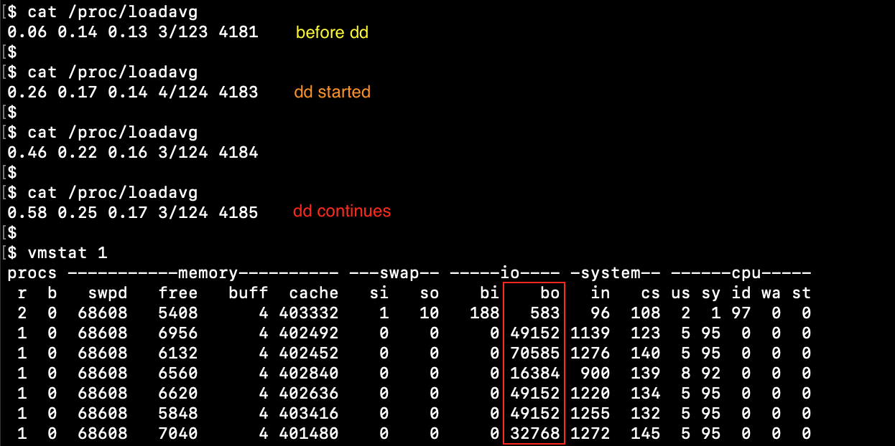
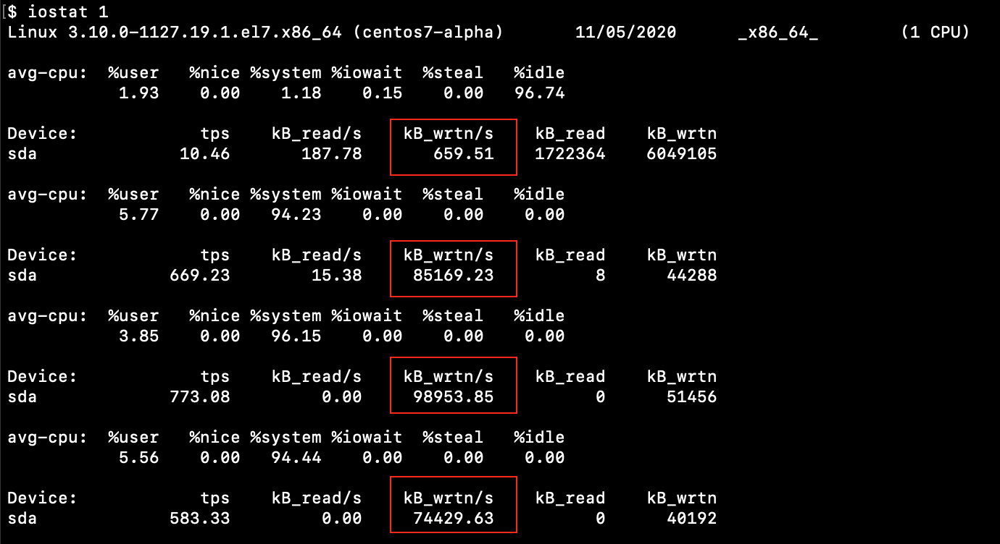
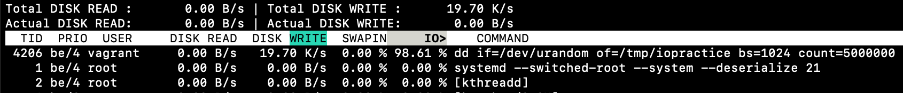

# la

## CPU usage

To produce high CPU load for 1 cpu
```
stress --cpu 1 --timeout 600
```

Check **top**




Check **/proc/loadavg**





The value for 1m avarage is growing, but there are only 2-4 active process with 125 total processes

Check **vmstat** every 1 second



These are percentages of total CPU time. 
**CPU us** - Time spent running non-kernel code. Our **stress** command use all CPU time.

Stop **stress** process, check **vmstat** again



No more **CPU us** load

## Disk usage

To produce Disk load
```
dd if=/dev/urandom of=/tmp/iopractice bs=1024 count=5000000
```

Check **/proc/loadavg** and then **vmstat** every 1 second





loadavg value grows, cpu usage do not change a lot, but **io bo** show I/O load.
**io bo** - blocks sent to a block device.


Check **iostat** every 1 second




**kB_wrtn/s** - indicate the amount of data read from the device (sda) expressed in a number of blocks (kilobytes, megabytes) per second. No high avg-cpu load.


Check **iotop** and see what process have high disk write value




**Troubleshooting iowait problem**

1. Find high **wa** in **top**.
2. Find which disk is being written **iostat -x 2**. Check out %util column.
3. Find processes that cause high I/O wait with **iotop**. Get PID.
4. Find which file caused the i/owait with **lsof -p PID**.