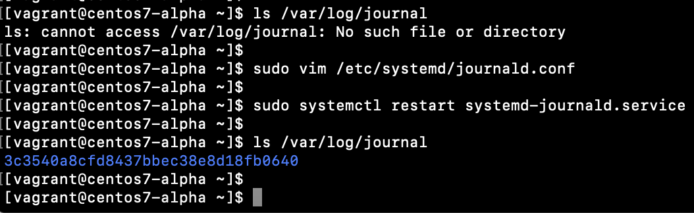
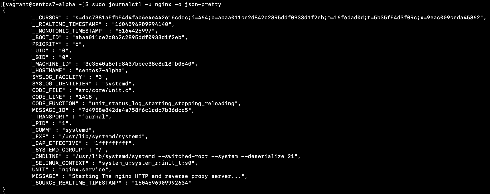
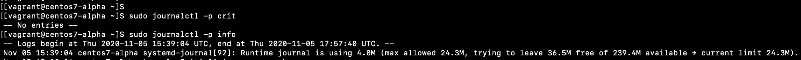
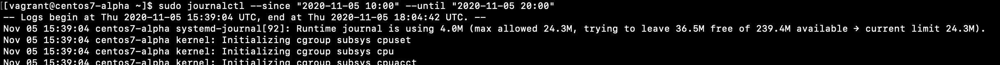
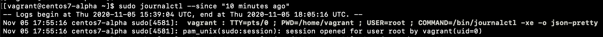

# logging

## journald
Make journald logs persistent

```
sudo vim /etc/systemd/journald.conf
```
Change
```
[Journal]
Storage=persistent
```



Now logs will not disappear after the reboot.


Output format
```
sudo journalctl -u nginx -o json-pretty
```




Filter by log level
```
sudo journalctl -p crit
sudo journalctl -p info
```




Filter by date and time
```
sudo journalctl --since "2020-11-05 10:00" --until "2020-11-05 20:00"
sudo journalctl --since "10 minutes ago"
```






