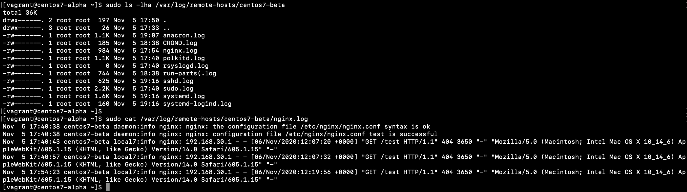

# logging

## journald
Make journald logs persistent

```
sudo vim /etc/systemd/journald.conf
```
Change
```
[Journal]
Storage=persistent
```


Now logs will not disappear after the reboot.


Output format
```
sudo journalctl -u nginx -o json-pretty
```


Filter by log level
```
sudo journalctl -p crit
sudo journalctl -p info
```


Filter by date and time
```
sudo journalctl --since "2020-11-05 10:00" --until "2020-11-05 20:00"
sudo journalctl --since "10 minutes ago"
```


## rsyslog

Two VMs:
* centos7-alpha 192.168.30.20 (rsyslog)
* centos7-beta  192.168.30.21 (web-server)

Change the configuration

```
sudo vim /etc/rsyslog.conf 
```

centos7-alpha config changes:
```
# Provides UDP syslog reception
$ModLoad imudp
$UDPServerRun 514

# Provides TCP syslog reception
$ModLoad imtcp
$InputTCPServerRun 514

# Templates
$template RemoteHostLog,"/var/log/remote-hosts/%HOSTNAME%/%PROGRAMNAME%.log"
$template RemoteHostFormat, "%timegenerated% %hostname% %syslogfacility-text%:%syslogpriority-text% %syslogtag%%msg:::drop-last-lf%\n"

# Modules
:inputname, isequal, "imudp" ?RemoteHostLog;RemoteHostFormat

& ~
```

centos7-beta config:
```
#*.* @@remote-host:514
*.* @192.168.30.20:514
```

Restart rsyslog on both VMs
```
sudo systemctl restart rsyslog.service 
```

Configure nginx on centos7-beta to send logs to the remote rsyslog
In /etc/nginx/nginx.conf edit next lines
```
#access_log  /var/log/nginx/access.log  main;
access_log syslog:server=192.168.30.20:514,facility=local7,tag=nginx,severity=info main;
```

Restart nginx to apply new configuration
```
sudo systemctl restart nginx.service 
```



