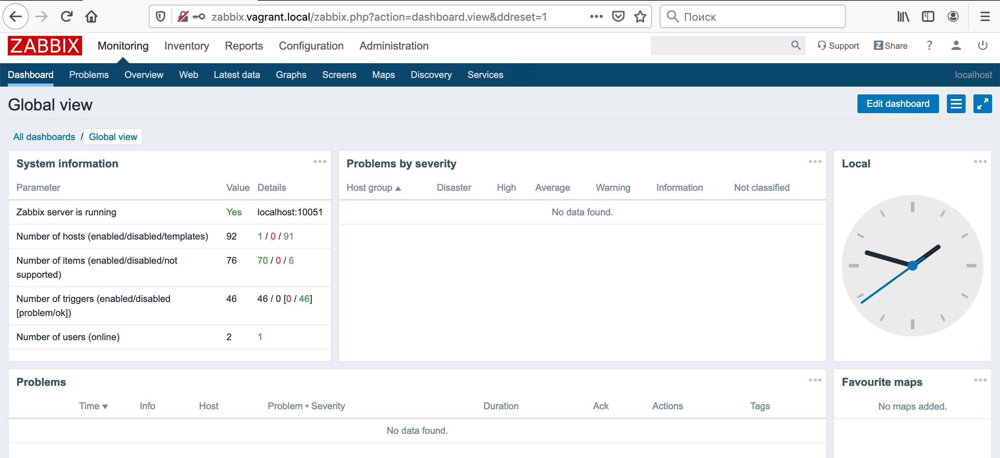
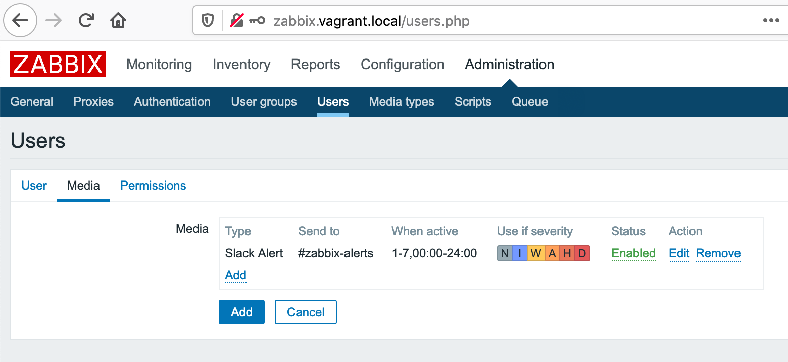

# zabbix

## Install Zabbix-Server
```
sudo rpm -Uvh https://repo.zabbix.com/zabbix/4.0/rhel/7/x86_64/zabbix-release-4.0-2.el7.noarch.rpm
sudo yum install zabbix-server-mysql zabbix-web-mysql zabbix-agent
```

## Install MariaDB

```
sudo yum install mariadb-server mariadb
```

Start service
```
sudo systemctl start mariadb
sudo systemctl enable mariadb
```
 
Run security script (Leave it blank, if you've just installed MariaDB)
```
sudo mysql_secure_installation
```

## Configure Zabbix-Server and MariaDB
```
### DEMO PASSWORDS

shell> mysql -uroot -pvagrant
mysql> create database zabbix character set utf8 collate utf8_bin;
mysql> grant all privileges on zabbix.* to zabbix@localhost identified by 'zabbix';
mysql> quit;
```

Import database scheme
```
### DEMO PASSWORDS

sudo zcat /usr/share/doc/zabbix-server-mysql*/create.sql.gz | mysql -uzabbix -p zabbix
```

Configure Zabbix server connection to database in **/etc/zabbix/zabbix_server.conf**
```
### DEMO PASSWORDS

DBHost=localhost
DBName=zabbix
DBUser=zabbix
DBPassword=zabbix
```

## Start Zabbix-Server

Start service
```
sudo systemctl start zabbix-server
sudo systemctl enable zabbix-server
```


## Install nginx

Add nginx repository
```
sudo yum install epel-release
```

Install nginx
```
sudo yum install nginx
```

Start service
```
sudo systemctl start nginx
sudo systemctl enable nginx
```


## Install PHP-FPM

Add popular repository with php up-to-date php releases
```
sudo yum install http://rpms.remirepo.net/enterprise/remi-release-7.rpm
```

Enable remi package with php
```
yum --disablerepo="*" --enablerepo="remi-safe" list php[7-9][0-9].x86_64

sudo yum-config-manager --enable remi-php74
```

Install php
```
sudo yum install php php-mysqlnd php-fpm php-mysql
```

Change php-fpm configuration in **/etc/php-fpm.d/www.conf**
```

# User group
user = nginx
group = nginx

# Listen on socket file
listen = /var/run/php-fpm/php-fpm.sock;

listen.owner = nginx
listen.group = nginx
listen.mode = 0660
```

Start service
```
sudo systemctl start php-fpm
sudo systemctl enable php-fpm
```

## Nginx configuration
Change permissions for nginx
```
sudo chown -R nginx:nginx /var/lib/php/session
sudo chown -R nginx:nginx /etc/zabbix/web
```

Nginx virtual host configuration
```
sudo mv zabbix.conf /etc/nginx/conf.d/zabbix.conf

sudo systemctl restart nginx
```





## Install Zabbix-agent

Add repository
```
sudo yum install epel-release
sudo rpm -Uvh https://repo.zabbix.com/zabbix/4.2/rhel/7/x86_64/zabbix-release-4.2-2.el7.noarch.rpm
```

Install Zabbix agent
```
sudo yum install zabbix-agent zabbix-sender
```

Configure Zabbix agent in **/etc/zabbix/zabbix_agentd.conf**
```
Server=192.168.30.20
ServerActive=192.168.30.20
Hostname=Beta-server
```

Start service
```
sudo systemctl enable zabbix-agent
sudo systemctl status zabbix-agent
```

Check
```
sudo ss -tunelp | grep 10050
```

## Add new host to Zabbix

Configuration -> Hosts -> "Create host" button


Add templates


List of all hosts


## Monitoring

Check CPU Load Graph for Beta-server for last 10 min

Monitoring -> Graphs -> Group(Linux Server) -> Host(Beta-server) -> Graph(CPU load) -> View as(Graph)


## Slack notification

Create Slack App for Zabbix Notifications and create Incoming Webhook in some channel (zabbix-alerts)

Check with curl (secrets removed)
```
curl -X POST -H 'Content-type: application/json' --data '{"text":"Hello, World!"}' https://hooks.slack.com/services/***/***/***
```

Find alert scripts directory and put there slack.sh script

```
sudo cat /etc/zabbix/zabbix_server.conf | grep AlertScriptsPath
```

Create Media Type for that script

Administration -> Media types -> "Create media type" button


Create Slack user group with permissions

Administration -> User groups -> "Create user group" button


Create Slack user with Media

Administration -> Users -> "Create user" button





Create Actions

Configuration -> Actions -> "Create action" button


Stress our Beta-server to trigger the notification


