# netfilter

## firewalld

Get state and list all

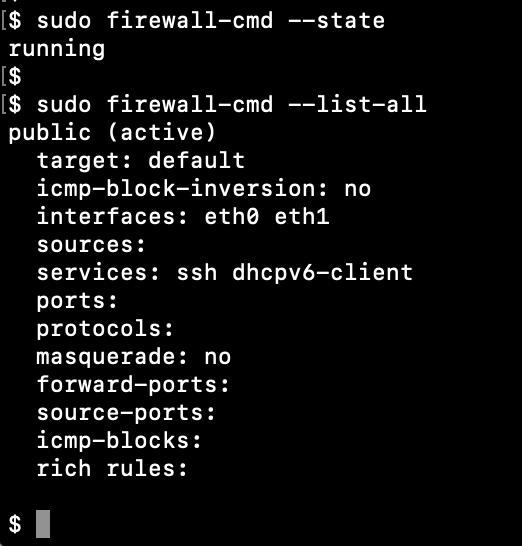


Get info about zone (example public)

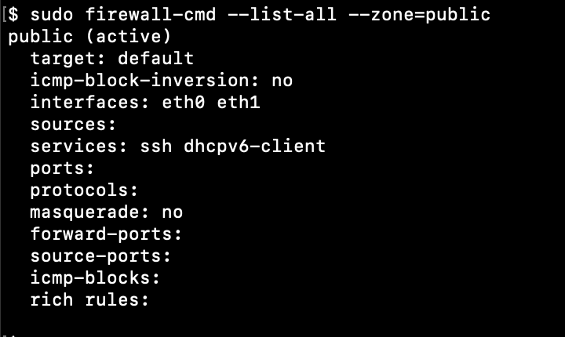


add and remove service (example mysql, port 3306)

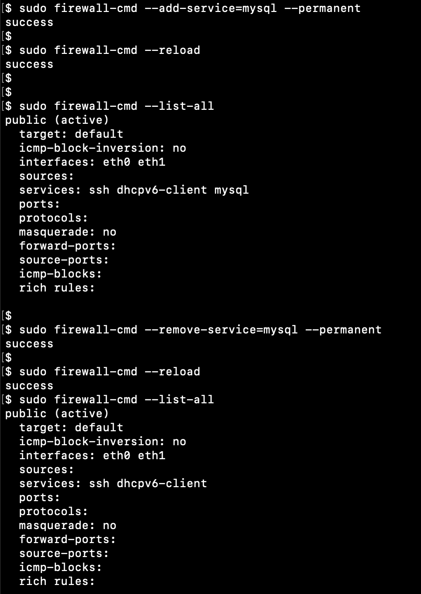


Curl check

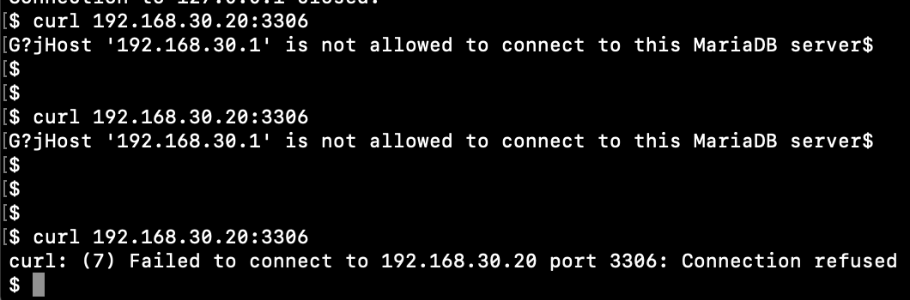


Add port forwarding (3307->3306)

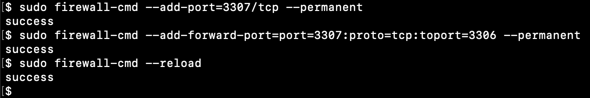


Curl check

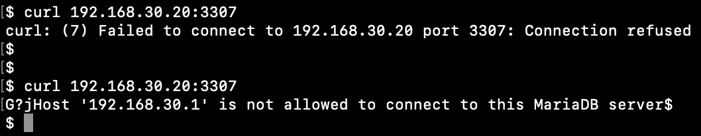


Check if service and interface were added to zone

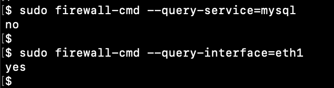


**/usr/lib/firewalld/services/*.xml**

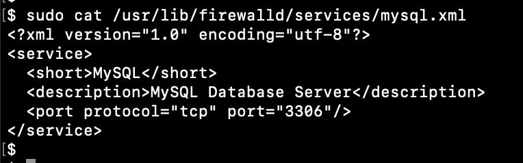


**check changes in iptables IN_public_allow**

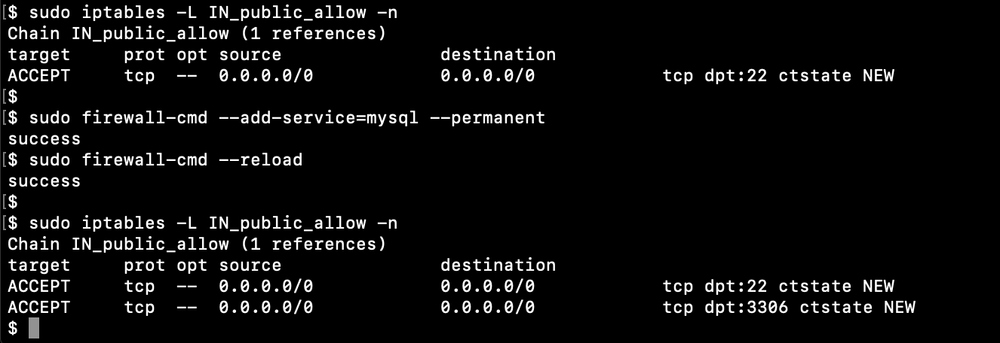


Add new zone for mysql and add source

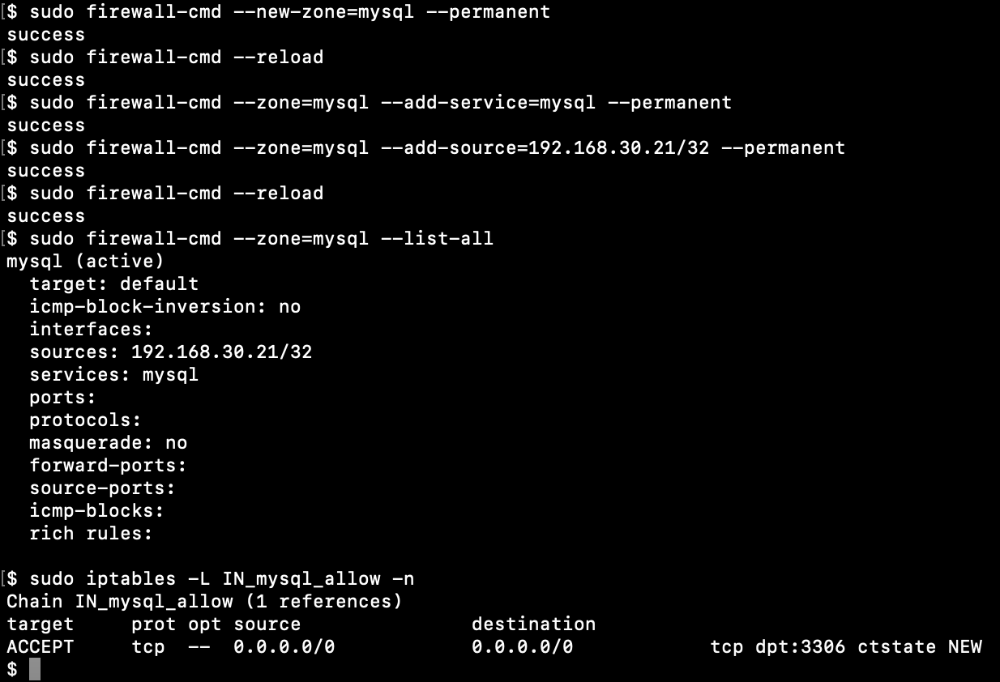


Check with curl from two hosts

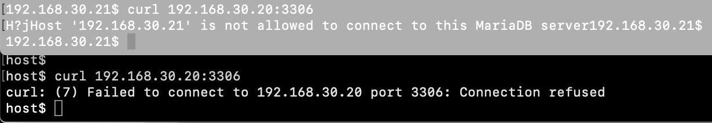


## connections
Connections states
```
sudo less /proc/net/nf_conntrack
```

Count
```
sudo less /proc/net/nf_conntrack | wc -l
```

Current configuration
```
sudo sysctl -a | grep conntrack
```
**net.nf_conntrack_max = 15588** - change for highload to bigger value

Limit connections from one source (with iptables)
```
iptables -A INPUT -p tcp --syn --dport 22 -m connlimit --conlimit-above 3 -j REJECT
```

## iptables

All iptables rules
```
sudo iptables -L -n -v
```

Specific table (example filter)
```
sudo iptables -L -n -v -t filter
```

Block/Unblock source
```
# Block all
sudo iptables -A INPUT -s 192.168.30.21 -j DROP

# Block only TCP
sudo iptables -A INPUT -p tcp -s 192.168.30.21 -j DROP

# Block by MAC
sudo iptables -A INPUT -m mac --mac-source 08:00:27:6c:5d:2c -j DROP

# Unblock
sudo iptables -D INPUT -s 192.168.30.21 -j DROP
```

Allow incoming connections on port/ports
```
# Single port
sudo iptables -A INPUT -p tcp --dport 8080 -j ACCEPT

# Multiple ports
sudo iptables -A INPUT  -p tcp -m multiport --dports 8081,8082,8083 -j ACCEPT
```

Block outgoing trafic for destination range
```
sudo iptables -A OUTPUT -p tcp -d 192.168.30.0/24 -j DROP
```

Block ping requests
```
sudo iptables -A INPUT -p icmp -i eth1 -j DROP
```