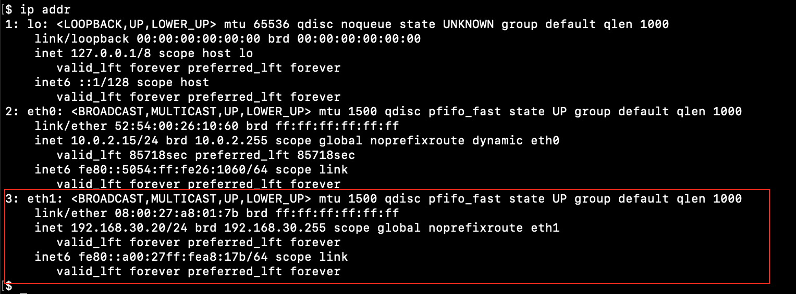
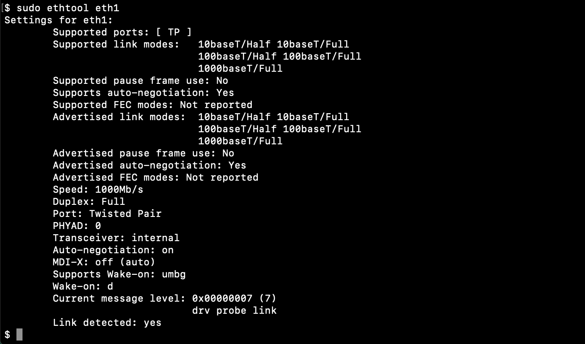
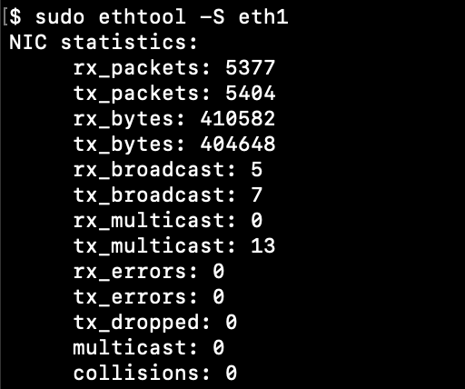
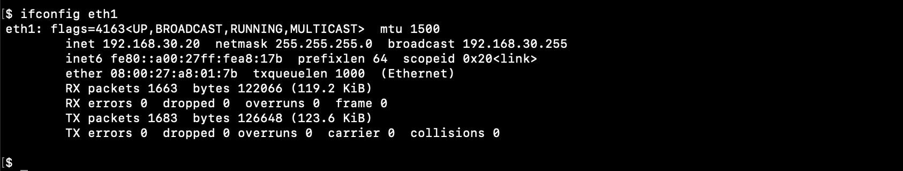
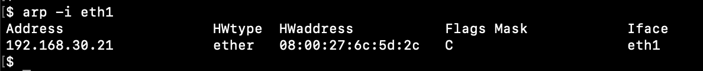

# network

## ip addr

* **eth1** - Interface name
* **mtu 1500** - maximum transmission unit, 1500, size of the largest frame/protocol-dat-unit(PDU), that can be send over this interface
* **qdisc** - queuing discipline, shows the queuing algorithm used on the interface
* **qlen 1000** - transmission queue length
* **link/ether** - data link layer protocol, Ethernet
* **08:00:27:a8:01:7b** - MAC address, 48 bits, 6 octets, MM:MM:MM:SS:SS:SS, M-ID number of the adapter manufacturer, S-serial number assigned to the adapter by the manufacturer
* **brd ff:ff:ff:ff:ff:ff** - broadcast MAC address
* **inet** - network layer protocol, internet IPv4
* **192.168.30.20/24** - IP address
* **brd 192.168.30.255** - broadcast IP address

## ethtool

Statistic

* **tx_packets** - trasmitted packets
* **rx_packets** - received packets
* **tx_errors** - trasmission errors
* **rx_errors** - teceived errors
* **rx_missed** - recieved misses

## ifconfig

* **eth1** - Interface name
* **flags** - Interface status
    * **UP/DOWN** - initialized/not initialized 
    * **BROADCAST** - broadcast status, indicates that the interface supports IPv4 broadcasts
    * **RUNNING** - transmission status, indicates that the system is transmitting packets through the interface
    * **MULTICAST** - multicast status, shows that the interface supports multicast transmissions
* **mtu 1500** - maximum transmission unit, 1500, shows that this interface has a maximum transfer size of 1500 octets. 
* **inet 192.168.30.20** - IP address, IPv4
* **netmask 255.255.255.0** - netmask, displays the IPv4 netmask of the particular interface.
* **broadcast 192.168.30.255** - broadcast IP address
* **ether 08:00:27:a8:01:7b** - MAC address, shows the interface's Ethernet layer address. 
* **RX packets** - total number of packets received
    * **RX bytes** - total number of bytes received over interface
* **RX errors** - total number of packets received with error
* **TX packets** - total number of packets transmitted
    * **TX bytes** - total number of bytes transmitted over interface
* **TX errors** - total number of packets transmitted with error

## arp

ARP Cache

* **192.168.30.21** - IP address of the neighboring host
* **ether** - Hardware Type, Ethernet
* **08:00:27:6c:5d:2c** -  MAC address of the neighboring host
* **eth1** - Interface name

