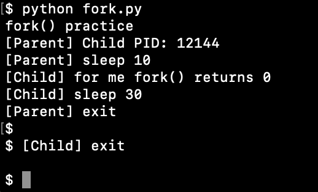
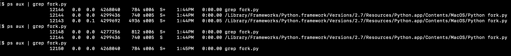
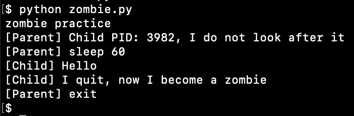
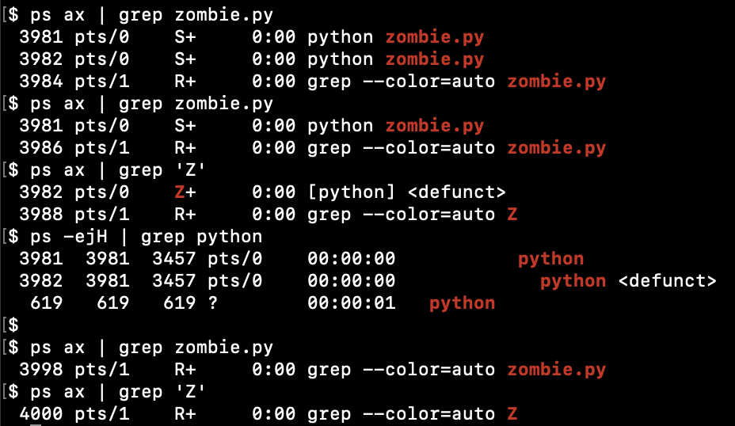
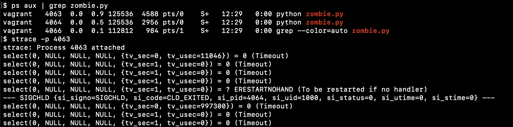
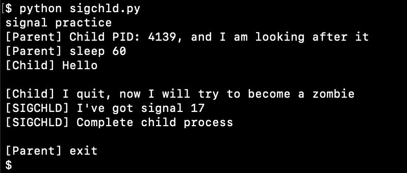
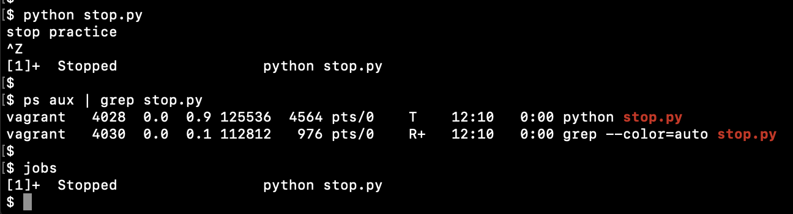
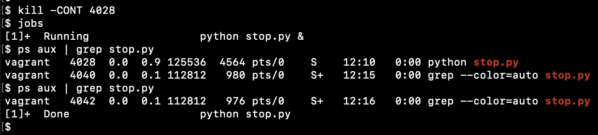
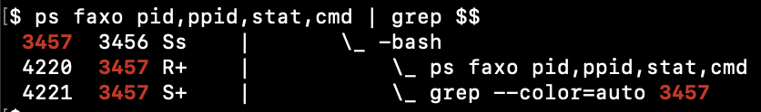
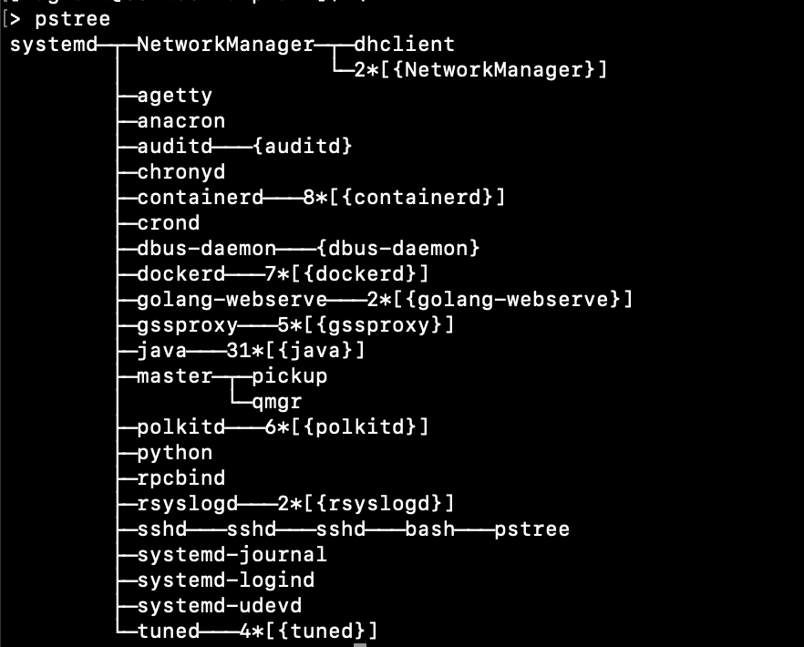

# processes

## fork()

Create fork() in python programm, check PID, check prcesses status




## zombie

Parent process do not handle exit of child process, child become a zombie





To kill a zombie

```
gdb -p <PPID>  # will change process state to t+ (TRACE)

call wait()

# Example output:
$1 = 4064 
```

## SIGCHLD 

Now program can handle incoming SIGCHLD signal 




## stop

Process receive SIGSTOP, and then wait for SIGKILL or SIGCONT.





## ps



## proc

`/proc/<pid>/`

* stat - status information about the process (used by ps)
* status - provides much of the information in /proc/[pid]/stat and /proc/[pid]/statm in a format that's easier for humans to parse
* cwd - this is a symbolic link to the current working directory of the process
* cmdline - the complete command line for the process, unless the process is a zombie
* environ - file contains the initial environment that was set when the currently executing program was started via execve
* io - contains I/O statistics for the process
* maps - file containing the currently mapped memory regions and their access permissions
* statm - provides information about memory usage, measured in pages
* mem - file can be used to access the pages of a process's memory through open, read, and lseek.
* fd - subdirectory containing one entry for each file which the process has open, named by its file descriptor, and which is a symbolic link to the actual file
* exe - file is a symbolic link containing the actual pathname of the executed command.


## pstree

```
sudo yum install psmisc

pstree
```


## lsof

```
sudo yum install lsof

sudo lsof -p <PID>
```

## fuser

```
sudo fuser <path/to/file>
```