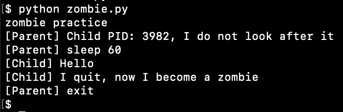
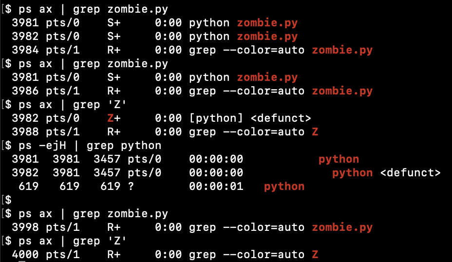

# processes

## fork()

Create fork() in python programm, check PID, check prcesses status


## zombie

Parent process do not handle exit of child process, child become a zombie





## pstree

```
sudo yum install psmisc

pstree
```
