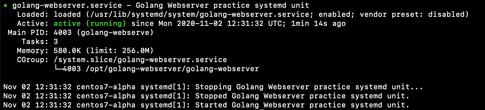
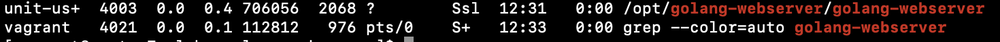
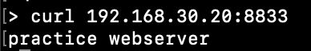

# golang-webserver

# Build
```
GOOS=linux go build -a -o ./golang-webserver ./main.go
```

# Run
Default PORT is 8181
```
./golang-webserver
```

PORT from envs
```
PORT=8282 ./golang-webserver 
```

# Prepare
```
sudo mkdir -p /opt/golang-webserver
sudo mv ./golang-webserver /opt/golang-webserver/
sudo chown unit-user:unit-user /opt/golang-webserver
```

# Unit
```
sudo cp unit-file /lib/systemd/system/golang-webserver.service
sudo systemctl daemon-reload
sudo systemctl start golang-webserver.service
sudo systemctl enable golang-webserver.service
sudo systemctl status golang-webserver.service
```

Status




