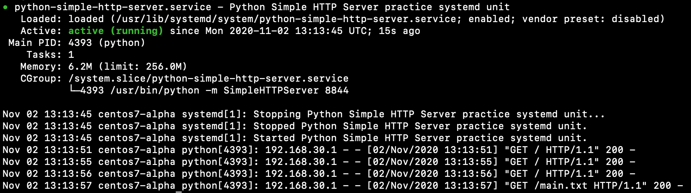

# python-simple-http-server

# Prepare
```
sudo mkdir -p /opt/python-simple-http-server
sudo chown unit-user:unit-user /opt/python-simple-http-server
```

# Unit
```
sudo cp unit-file /lib/systemd/system/python-simple-http-server.service
sudo systemctl daemon-reload
sudo systemctl start python-simple-http-server.service
sudo systemctl enable python-simple-http-server.service
sudo systemctl status python-simple-http-server.service
```

Status

