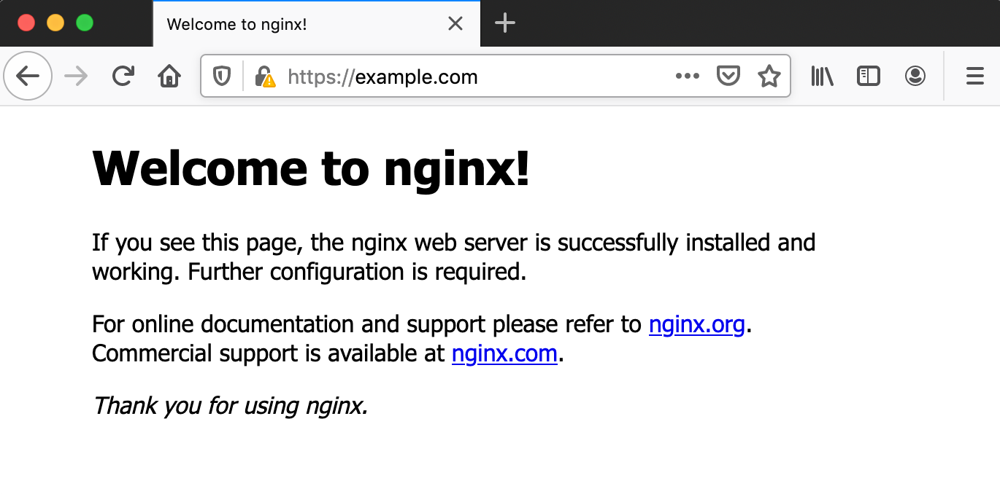
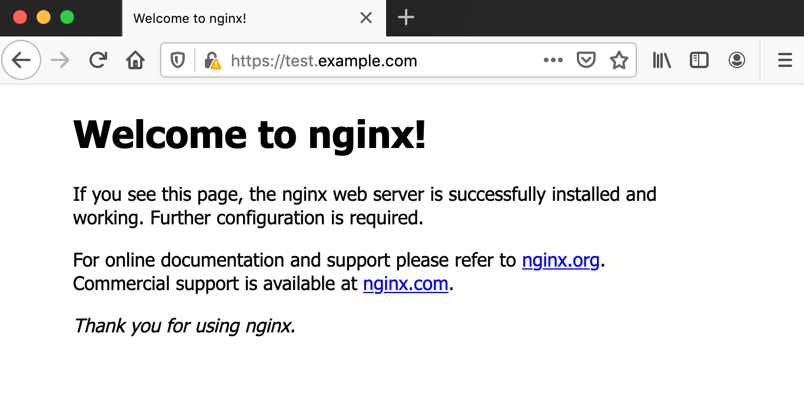
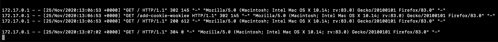
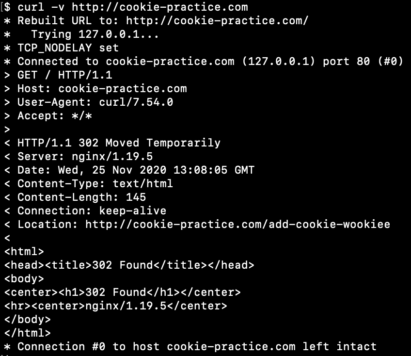
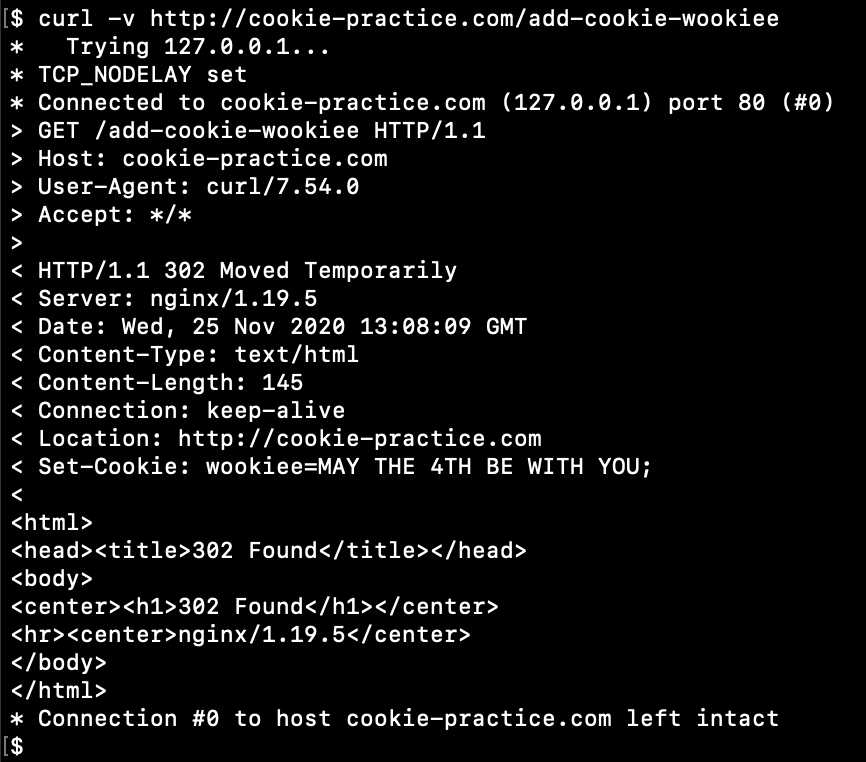
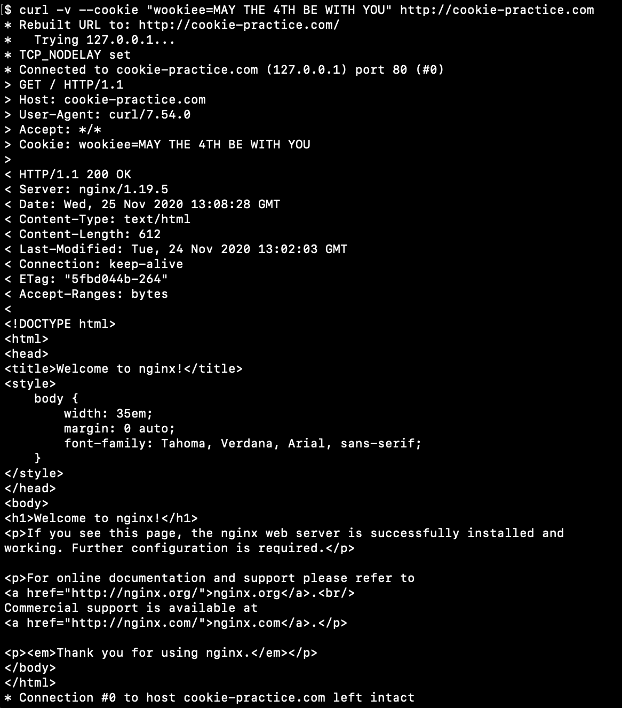
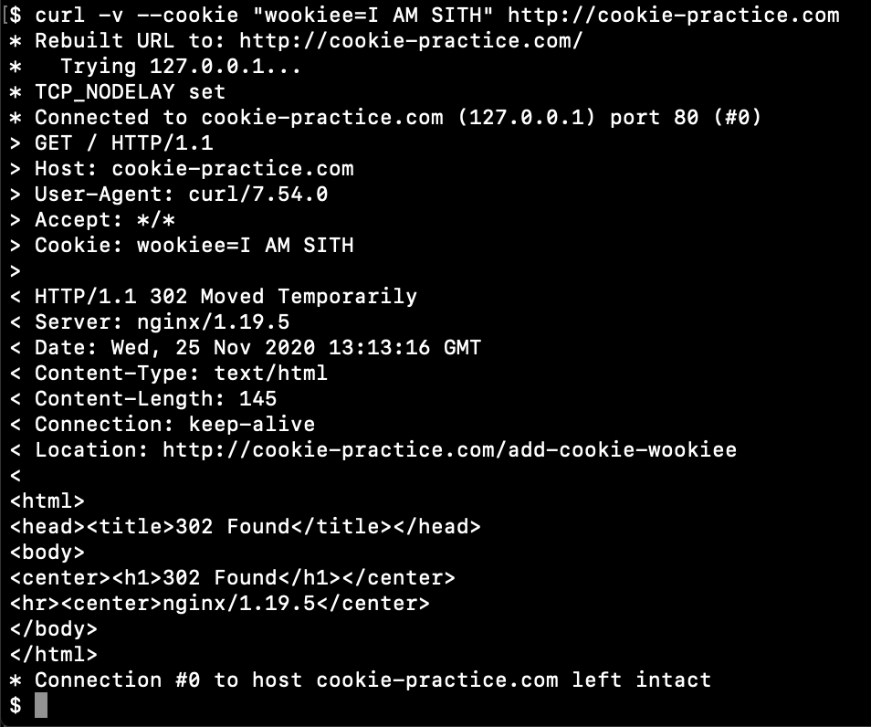

# webserver

## Build docker image
Move to **conf** directory
```
docker build -t nginx-practice -f ../Dockerfile .
```

## Start nginx docker container
```
docker run --rm -d --name=nginx-practice -p 80:80 -p 443:443 nginx-practice
```

## Setup domains for local
Add next lines to **/etc/hosts**

```
# LOCAL DOCKER
127.0.0.1 example.com
127.0.0.1 test.example.com
127.0.0.1 debug.example.com
127.0.0.1 cookie-practice.com
```

## Practice

**example.conf** 
* virtual host for domain **example.com** and all subdomains
* listen on **80** and **443** ports
* redirect from **http** to **https**
* enable **HSTS**

Check this out in web-browser

Main domain



Subdomain



**cookie.conf**
* open the index page if a client has the specified cookie
* if a client doesn't have the specified cookie then redirect him to the location, where the cookie will be added
* redirect a client to the index after the cookie was added

Open the index page, and then reload the page


Check this our with **curl**

Send the request without cookie, see the redirection and **Location** header



Send the new request to new location to get the cookie



Send the request with cookie, see that it works fine



Send the request with bad cookie, see that it works bad
